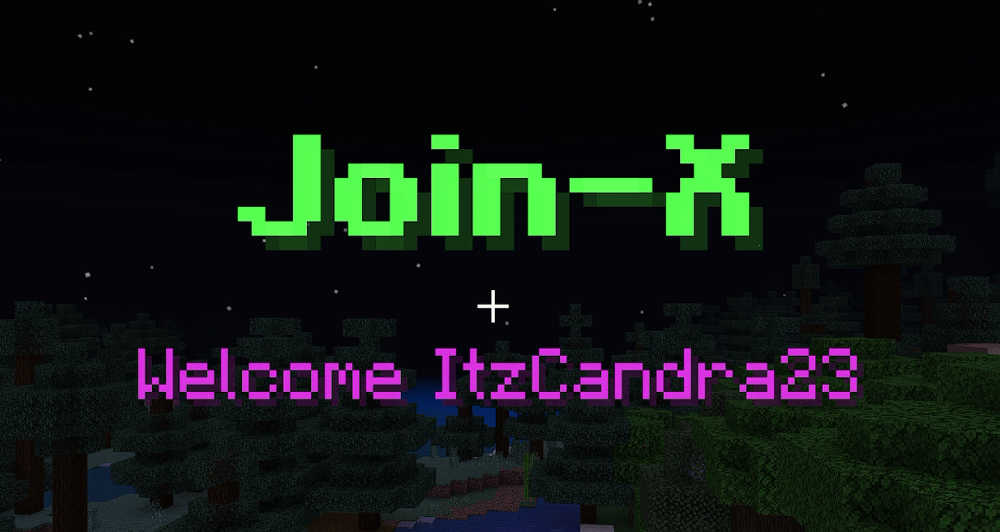

# JoinX

This is a JoinX plugin. This plugin will send the title or ui when the player join. This plugin for [BDSX Server](https://github.com/bdsx/bdsx).



## Commands

-   `/joinx` - `Customize JoinX configuration.` - `Operator`

## Customize

You can customize in `config.json` file.

```json
    "jointitle": {
        // This is title
        "title": "&l&aJoin-X",
        // You can use {name} for player name
        "subtitle": "&dWelcome {name}",
        // true for Show. You can change to false for hidden title
        "enable": true
    },
    "joinui": {
        // This is ui title
        "title": "&l&2Join-X",
        // In content you can customize like lines in scoreboard-x plugin
        "content": "Hi! &a{name}&r this is a &aJoinX&r plugin for BDSX.",
        // This is a close button
        "close": {
            "text": "&l&7[ &cClose &7]",
            "type": "path",
            "path": "textures/blocks/barrier",
        },
        // You can enable or disable for show or hidden ui
        "enable": true
    },
    "consoleMessage": "{name} joined to this server!",
    "sendToConsole": true,
    "enable": true
```

## Author

You can follow or subscribe me on this link for support me

-   [Github](https://github.com/ItzCandra23)
-   [Youtube](https://youtube.com/@itzcandra23)
-   [OmletArcade](https://omlet.gg/profile/candra_gaming123)
